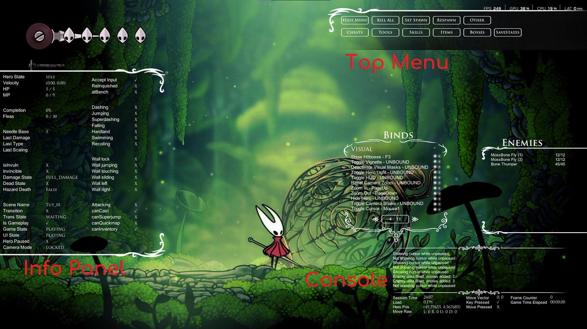

# Practice Tool Usage Guide

---

- [Practice Tool Usage Guide](#practice-tool-usage-guide)
  - [DebugMod Menu](#debugmod-menu)
  - [Savestates (In-game)](#savestates-in-game)
    - [Quickslot](#quickslot)
    - [Quickslot Save To/Load From File](#quickslot-save-toload-from-file)
      - [Direct to File](#direct-to-file)
  - [Savestates (Outside the game)](#savestates-outside-the-game)
    - [Naming savestates](#naming-savestates)
    - [I need more pages!](#i-need-more-pages)
  - [QuickWarp](#quickwarp)

---

> [!Warning]
> DebugMod's menus may break when using non-16:9 aspect ratios, and QuickWarp is only scaled for 1080p displays. If you are having trouble interacting with these menus, please try using a resolution of 1920x1080 while we address these issues.

## DebugMod Menu

Once DebugMod is installed, press F2 while ingame to bring up the menu. It might look daunting at first, but everything here is helpful!

To interact with it, you may need to pause to prevent the mouse getting captured. You can also bind `Toggle Cursor` in `Binds Panel > Visual` to allow you to unlock the cursor at any time.



- ### Info Panel

    The big panel on the left lists various bits of the current game state; the most useful parts are the top left (listing completion, fleas, and stats of the last hit dealt to an enemy) and the bottom left, which displays the name of the scene you're currently in.

- ### Top Menu

    This menu contains interactable buttons for many actions in DebugMod, accessible here so you don't have to set up a hotkey or browse the [Binds panel](#binds-panel) for each one.

    Most of these should be relatively self-explanatory; this is a section that is currently being fleshed out and as such this menu may look different for you.

- ### Binds Panel

    _**This is the most important panel in DebugMod;**_ it's where you set hotkeys for any of the actions DebugMod supports. To bind an action, click the glowing white circle & press a key. To unbind an action, click the glowing white circle & press Escape.

    You can also directly trigger most actions without setting a hotkey by pressing the "Play" button next to it.

    Note that many of DebugMod's features are _only_ accessibly via the Binds panel!

- ### Enemies Panel

    This shows all enemies in the current scene & lets you clone, destroy or set them to infinite health. Additionally there are a few buttons:
    - COLLISION shows enemy hitboxes; note this is largely redundant with the standard Hitbox view.
    - HP Bars shows an HP bar above every enemy.
    - AUTO automatically rescans the scene to check enemy health - without it the panel will not update.
    - SCAN manually rescans the scene to update the health values displayed.

- ### Console

    This displays log messages, including errors when DebugMod prevents you from performing certain actions.

## Savestates (In-game)

Savestates are the lifeblood of DebugMod; they allow you to reset back to a specific point in time, with any actions you have previously taken reverted to how they were when you created the savestate. 

> [!TIP]
> We recommend setting binds for these actions rather than using the buttons in the [Top Menu](#top-menu), as these are actions you will use frequently.

> [!NOTE]
> If some world or hero state is not reverted correctly when loading a savestate, _please report it as a bug by pinging @manicjamie in #ss-tech-support, or by creating an issue on [the issues page](<https://github.com/hk-speedrunning/Silksong.DebugMod/issues>)._

### Quickslot

The Quickslot is a single savestate slot you can load & save to.

- `Quickslot (Save)` creates a new savestate.
- `Quickslot (Load)` loads you to that savestate.

### Quickslot Save To/Load From File

If you want to return to a savestate later you can save it to a savestate file.

On all of the file operations, pressing the hotkey will bring up a menu in the top-middle of your screen. Press the number keys to select a slot, or press the `Next Save Page` or `Previous Save Page` to scroll through your pages.

- `Quickslot Save to File` saves your quickslot savestate to the selected savestate slot.

- `Quickslot Load From File` loads a savestate file into your quickslot; use `Quickslot (Load)` to load the savestate.

#### Direct to File

You can load/save states directly to files, skipping the quickslot if desired. This is generally not recommended, as loading direct from file means you need to select the slot you want to load every single time.

- `Save new state to file` creates a savestate & saves it to file. _Your Quickslot will be unmodified._

- `Load new state from file` loads a savestate directly from file. _Your Quickslot will be unmodified._

## Savestates (Outside the game)

Our resources include Savestate packs; these are sets of savestate files that people have collated for practice. A savestate pack looks something like this:
[Savestate Pack]
Each numbered folder is a page, and the `savestateN.json` files are individual savestates, in the order they appear on the page.

To install a savestate pack, go to your save files[^1] & open `DebugModData/Savestates Current Patch`. Then extract the contents of the savestate pack to this folder; allow overwrites if prompted.

When you load into the game, the savestates menu will contain these new savestates.

### Naming savestates

By default savestates are named automatically by DebugMod like `sceneName-Time_Date`. You can manually edit this name by editing the corresponding `savestateN.json` file; the start of these looks something like this:

```json
{
    "saveStateIdentifier": "Bone_01-1:18_28-Sep",
    "saveScene": "Bone_01",
    "savedPd": // and so on...
```

Edit the text between the quotes after `"saveStateIdentifier":` to change the name:

```json
{
    "saveStateIdentifier": "Beastfly Pogo",
    "saveScene": "Bone_01",
    "savedPd": // and so on...
```

### I need more pages!

If 100 savestates is not enough, you can increase the number of pages in the config file, located in your save files[^1] as `DebugModData/Settings.json`. Change `MaxSavePages` to whatever number you want!

> [!WARNING]
> You can't expand `MaxSaveSlots` (which is the number of slots per page) past the default value of 10; this is because you need to press a number key to select the slot, and there are only 10 number keys to work with.

## QuickWarp

QuickWarp is very simple; press F5 to open the menu, press an area to show all scenes in that area, press a scene to show all transitions in that scene, press a transition to warp to that transition.

If you need to change the default QuickWarp key, you can edit it in the config file, located within your game files[^2] at `BepInEx/config/io.github.hk-speedrunning.quickwarp.cfg`.

[^1]: Save files are located at:

    - Windows: `%APPDATA%\..\LocalLow\Team Cherry\Hollow Knight Silksong\`
    - Linux: `~/.config/unity3d/Team Cherry/Hollow Knight Silksong/`
    - MacOS: `~/Library/Application Support/unity.Team-Cherry.Silksong`

[^2]: Game files are located _(by default using Steam)_ at:

    - Windows: `C:\Program Files (x86)\Steam\steamapps\common\Hollow Knight Silksong\`
    - Linux: `~/.local/share/Steam/steamapps/common/Hollow Knight Silksong/`
    - MacOS: `~/Library/Application Support/unity.Team-Cherry.Silksong`
